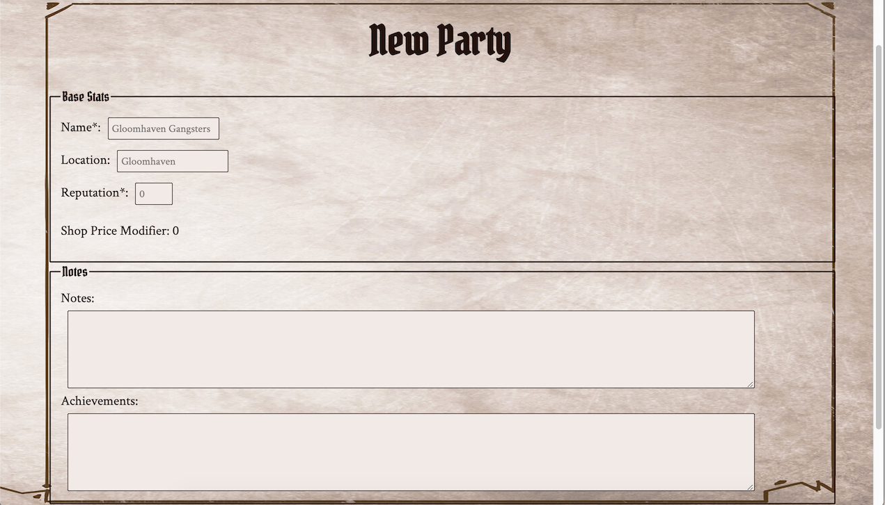

# Gloomhelper App

Gloomhelper is an app for users playing the board game [Gloomhaven](https://boardgamegeek.com/boardgame/174430/gloomhaven) to more easily see and save character and party sheets across plays, rather than using paper sheets (and running out of erasers!).

## readme requirements:

Screenshot(s) of your app. This makes your app description much easier to understand.
A section on the technology used.

## Link

[Live Demo](https://gloomhelper.carmarsden.now.sh)

## Screenshots

### Home Page:

### Account Modals:

Choosing to log in or create an account pops up a modal on screen, leaving your work or page intact.

All that's needed for account creating is username and password, so limited identifying information required

### Add New Party:

Create a new party; design based on the Gloomhaven paper party sheets

### Add New Character:

Create a new character; first select class and then fill in character details based on the Gloomhaven paper character sheets

### Dashboard:

View your previously saved parties and characters.

Note: ability to edit/update previously saved parties & characters is coming soon!

## Technology

### Built with:
* React, including Router & Context
    * Created with [create-react-app](https://github.com/facebook/create-react-app)
    * Confirmation modal via [react-modal](https://github.com/reactjs/react-modal)

### API Interface:
* Built to interface with Gloomhelper Server: [gloomhelper-server](https://github.com/carmarsden/gloomhelper-server)